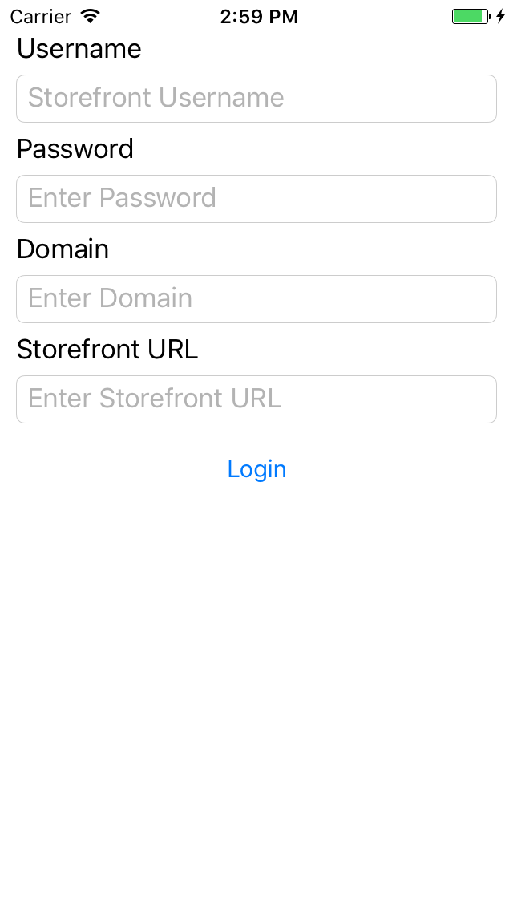
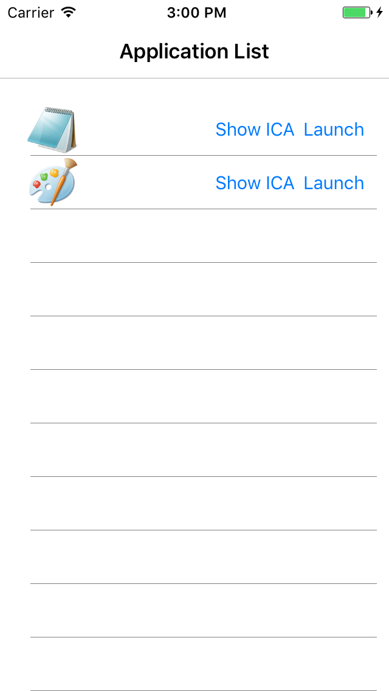
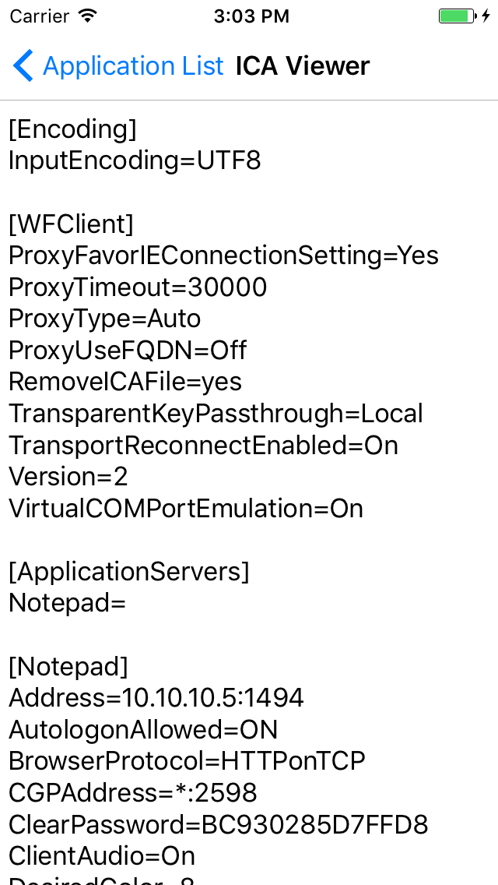
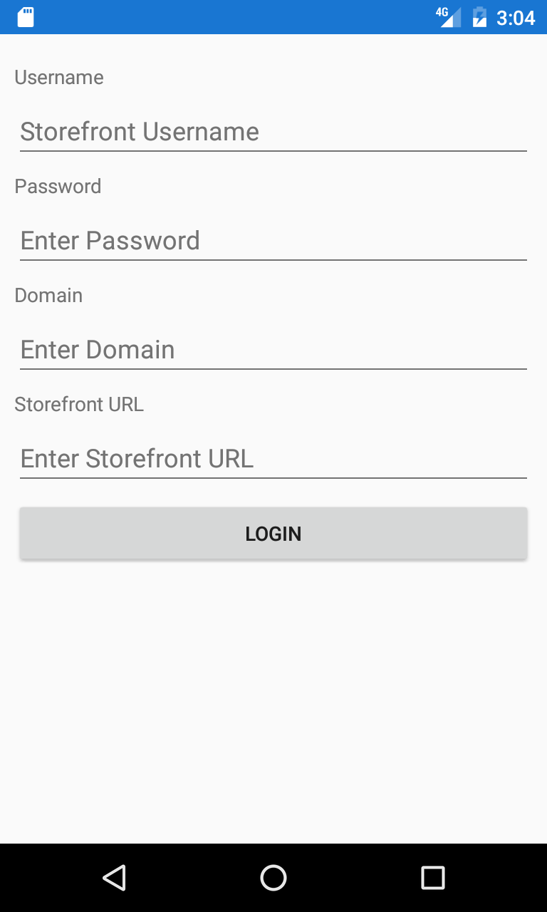
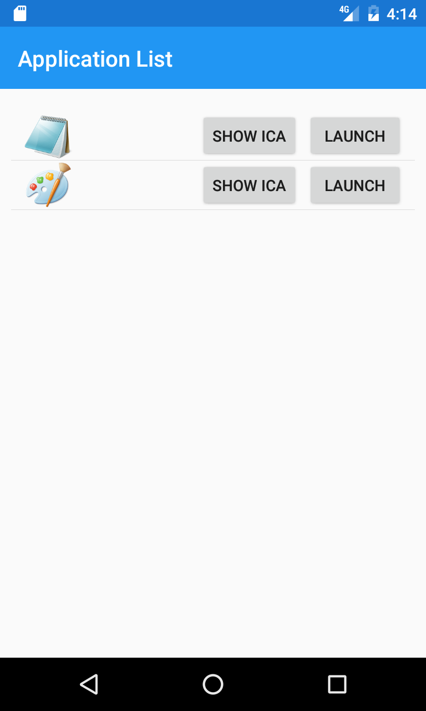
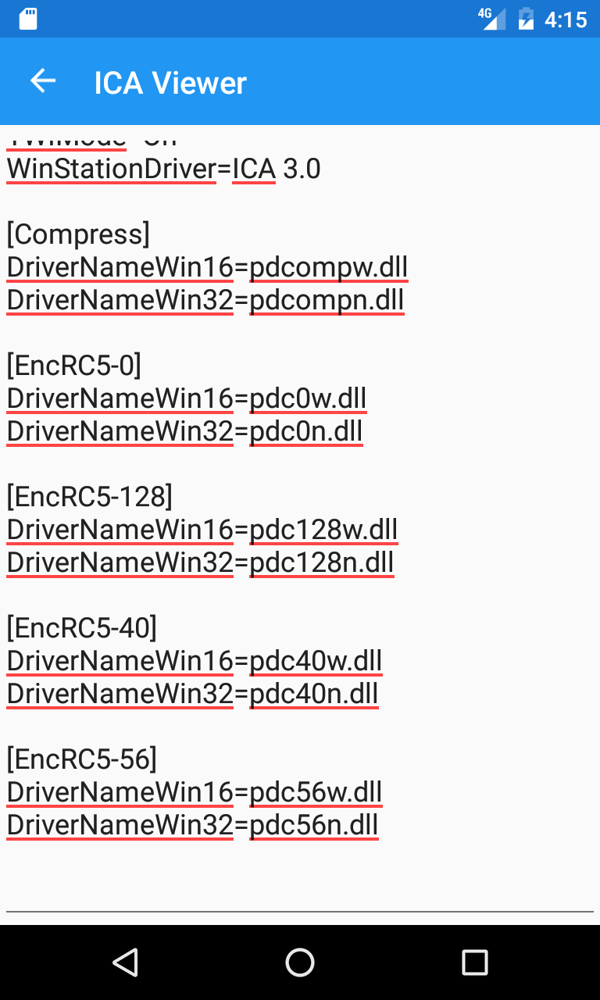

# Citrix Storefront API Xamarin Sample

This sample is meant to show you how to interact with the
Citrix Storefront API to authenticate, List your available
resources, and generate an ICA file that you can then pass
on to something like receiver to handle the connection. 

This is a base sample that shows how to use the Storefront API and will allow
you to build upon it to create your own solutions.

This sample is built using Xamarin.Forms to allows it to
run on both Android and iOS.

We have also published several helper pakages on our nuget feed to help you build this
type of sample. Check out the [following link](https://www.nuget.org/packages?q=citrix) for the packages

Here are some images that display the application. In the sample we have the following
  1. Login screen
  2. Application list screen
  3. ICA Viewer screen

### iOS
 

### Android
 

